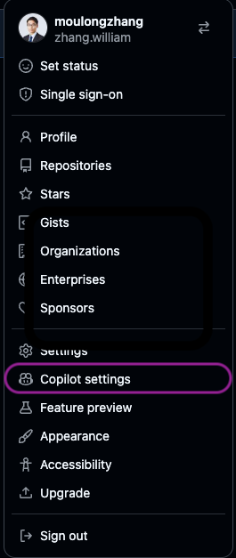
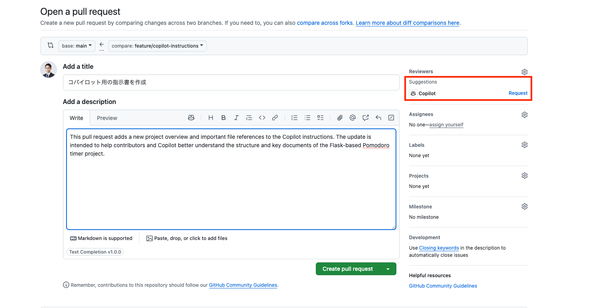
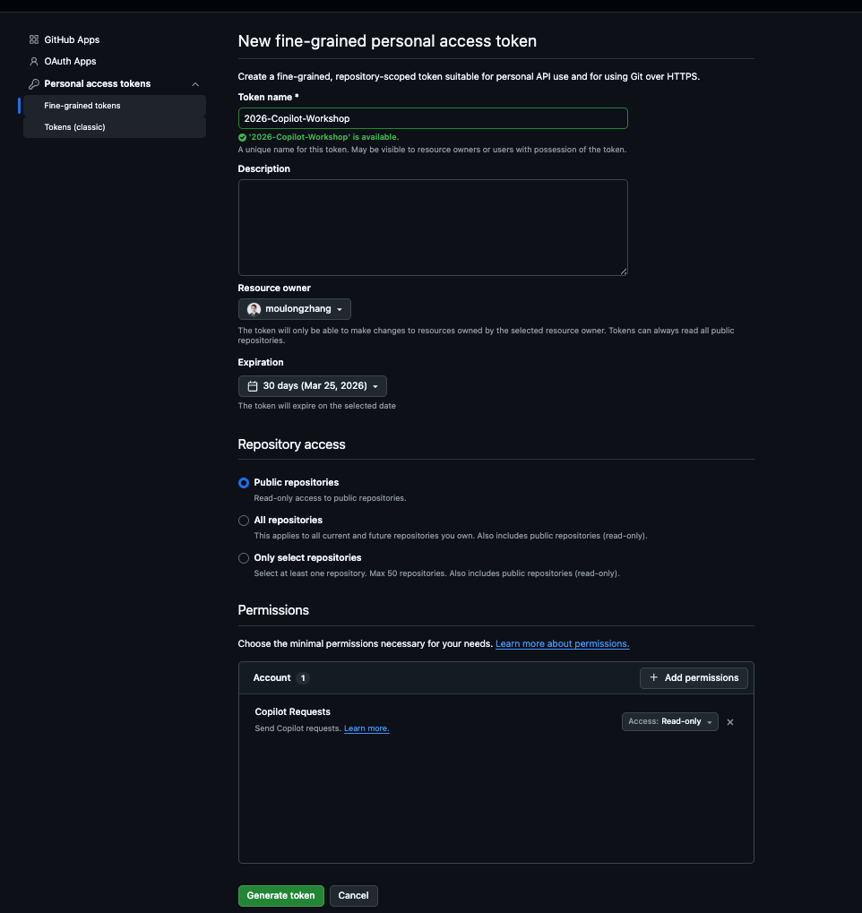

author: Your Name
summary: DENSO GitHub Copilot Workshop
id: github-copilot-workshop
categories: AI, Development
environments: Web
status: Published
feedback link: https://example.com/feedback

# DENSO GitHub Copilot Workshop

## About This Workshop
Duration: 5

Welcome to the GitHub Copilot Workshop!


In this workshop, you will experience the latest in AI-driven development, with a focus on **GitHub Copilot CLI**. Copilot CLI is an interactive AI assistant that runs in the terminal and can autonomously perform a wide range of tasks, including code generation, review, and refactoring.

### Today's Goals
- Understand the basic operations of GitHub Copilot CLI
- Experience web application development using the Copilot SDK
- Practice code reviews using multiple AI models
- Build development process automation with Agentic Workflows

### Today's Agenda

| Step | Topic | Overview |
|---|---|---|
| 1 | About This Workshop | Review the workshop overview and goals |
| 2 | Project Setup | Create a repository and prepare the development environment |
| 3 | Build an AI Chat Tool with the Copilot SDK | Build a web application with the Copilot SDK using a single prompt |
| 4 | Copilot Code Review | Review code using multiple models |
| 5 | Agentic Workflow | Automate the development process with AI agents |

### Prerequisites
- Visual Studio Code is installed
- You have a GitHub Copilot license (Business/Enterprise plan recommended)
- You have a GitHub account

## Project Setup
Duration: 15

In this workshop, we will use the following GitHub repository:

**Project URL**: https://github.com/moulongzhang/2026-Github-Copilot-Workshop-Python

### Step 1: Create a Repository from the Template

First, open the project URL above in your browser and create your own repository from the template:

1. Open the project URL (https://github.com/moulongzhang/2026-Github-Copilot-Workshop-Python) in your browser
2. Click the **Use this template** button in the upper right and select **Create a new repository**


Once the template creation is complete, a new repository will be created under your GitHub account.

### Step 2: Set Up the Development Environment

Use the repository you created to set up a development environment with GitHub Codespaces:

1. Go to the page for the repository you created (`https://github.com/copilot-hands-on/[repository-name]`)
2. Click the green **Code** button
3. Select the **Codespaces** tab
4. Click **Create codespace on main**


### Step 3: Verify Copilot Settings

Let's enable the Copilot features available on GitHub.

1. Click your profile icon in the upper right of GitHub
2. Select **Copilot Settings**



Enable the following features:

- **Copilot CLI** - Use Copilot in the terminal
- **Copilot code review** - Code review feature

> aside negative
>
> **Plan Limitations**: Features such as Copilot Code Review and Copilot CLI are only available with GitHub Copilot Business/Enterprise plans.

## Let's Build an AI Chat Tool with the Copilot SDK
Duration: 10

From here, we will use the **Copilot SDK** to build a generative AI chat tool that runs in the browser **from Copilot CLI with a single prompt**.

### What is the Copilot SDK?

The **Copilot SDK** is an SDK for programmatically controlling GitHub Copilot CLI. It communicates with Copilot CLI via JSON-RPC, allowing you to integrate capabilities such as creating AI sessions, sending and receiving messages, and receiving streaming responses into your applications.

**SDK Repository**: [https://github.com/github/copilot-sdk](https://github.com/github/copilot-sdk)

### What You'll Build

You'll build a web application that lets you chat with AI in real time from your browser:

- **Frontend**: A browser-based chat UI (React + TypeScript)
- **Backend**: A Node.js server that manages AI sessions using the Copilot SDK
- **Real-time communication**: Delivers streaming responses over WebSocket

### Key Copilot SDK APIs

| API | Description |
|---|---|
| `CopilotClient` | Client that manages the connection to the CLI server |
| `client.createSession()` | Creates a new conversation session |
| `session.send()` | Sends a message |
| `session.on("assistant.message_delta")` | Receives streaming response chunks |
| `session.on("assistant.message")` | Receives the final response |
| `session.on("session.idle")` | Detects when session processing is complete |
| `approveAll` | Automatically approves all tool execution permissions |
| `createChatTools()` | Generates the standard toolset for chat |
| `hooks.onPreToolUse` | Hook that runs before tool execution (used for input validation, transformation, and more) |
| `hooks.onPostToolUse` | Hook that runs after tool execution (used for logging, processing results, and more) |

### Basic SDK Usage

```javascript
import { CopilotClient, approveAll, createChatTools } from "@github/copilot-sdk";

const client = new CopilotClient();
await client.start();

const session = await client.createSession({
    model: "gpt-5",
    onPermissionRequest: approveAll,
    tools: createChatTools(),
    hooks: {
        onPreToolUse: (input, invocation) => {
            console.log(`Before tool execution: ${invocation.toolName}`, input);
        },
        onPostToolUse: (input, invocation) => {
            console.log(`After tool execution: ${invocation.toolName}`, input);
        },
    },
});

session.on("assistant.message_delta", (event) => {
    process.stdout.write(event.data.deltaContent);
});

await session.send({ prompt: "Hello!" });
```

> aside positive
>
> **Key Point of This Section**: Without preparing a design document or detailed specifications, you'll build a web application using the SDK all at once simply by giving Copilot CLI **a single prompt**. Experience the productivity of AI-driven development.

## Implement with Vibe Coding
Duration: 60

Now that you understand the Copilot SDK overview, it's time to implement a browser-based AI chat tool with **Vibe Coding**.

### Step 1: Launch Copilot CLI

Launch Copilot CLI in the VS Code terminal.

```bash
copilot
```

### Step 2: Allow All Permissions

```
/allow-all
```

`/allow-all` is a command that grants **all permissions at once for tool execution, file access, and external URL access** to Copilot CLI.

Normally, Copilot CLI prompts the user for permission each time it reads or writes files, executes commands, or communicates externally for security purposes. Running `/allow-all` skips these confirmation prompts, allowing Copilot to autonomously create and edit files, install packages, start servers, and more.

> aside negative
>
> **Note**: `/allow-all` is only effective for the current session. For security reasons, only use it with trusted projects. If you prefer to grant permissions individually, you can also use `/add-dir` to set directory-level access permissions.

### Step 3: Select a High-end Model

```
/model
```

From the list of models, select the most powerful model (for example, Claude Opus 4.6). A high-end model with strong reasoning capabilities is effective for building a web application with multiple components.

### Step 4: Switch to Autopilot Mode

Press **Shift+Tab** to switch Copilot CLI to **Autopilot mode**. In Autopilot mode, Copilot autonomously creates and edits files and executes commands without asking for confirmation, making it ideal for Vibe Coding large implementations all at once.

### Step 5: Implement Everything at Once with a Single Prompt

Enter the following prompt in Copilot CLI. The `/fleet` command runs multiple agents in parallel to build a browser-based AI chat tool using the SDK all at once:

```
/fleet Using the Copilot SDK, build an AI chat web application that runs in a browser in the copilotWebRelay/ directory.

SDK reference: https://github.com/github/copilot-sdk

Requirements:
- Backend: Node.js + Express + WebSocket server
  - Manage sessions with the Copilot SDK's CopilotClient
  - Use model "gpt-5" with createSession(), and use approveAll for onPermissionRequest
  - Stream responses to the client over WebSocket with session.on("assistant.message_delta")
  - Notify the client of completion with session.on("session.idle")
- Frontend: React + TypeScript + Vite
  - Modern chat UI (message input field, send button, and chat history display)
  - Connect to the server with WebSocket and display streaming responses in real time
  - Support Markdown rendering
- Development environment: Backend and frontend can be started simultaneously with npm scripts
- Verify that the application works
```

> aside positive
>
> **Single-Prompt Tip**: Structure the requirements as a bulleted list and clearly specify the technology stack, SDK APIs, and expected behavior so Copilot can build the application accurately.

### Hints If You Get Stuck

If errors occur during implementation, try the following:

- **Share the error message directly with Copilot**: Simply saying "Please fix this error" is often enough
- **Check changes with `/diff`**: Verify there are no unintended changes
- **Switch models with `/model`**: Try a different model and retry

> aside negative
>
> **Common Pitfalls**:
> - **Installing the Copilot SDK**: Make sure `npm install @github/copilot-sdk` runs successfully
> - **Authentication**: Make sure Copilot CLI is signed in (the `copilot` command works)
> - **Vite WebSocket proxy**: You need to specify `http://` instead of `ws://` for the `target`
> - **React StrictMode**: `useEffect` running twice can cause unstable WebSocket connections

## Copilot Code Review — Code Review with Multiple Models
Duration: 30

Once the Copilot Web Relay implementation is complete, use the **review-related Copilot CLI commands** to conduct code reviews with multiple AI models. The goal is to identify quality, security, and performance issues from the different perspectives of multiple models.

### Key Commands for Reviews

Copilot CLI provides several commands that you can use for code reviews.

| Command | Description |
|---|---|
| `/review` | Run the code review agent to analyze changes |
| `/model` | Select the AI model to use (Claude, GPT, Gemini, etc.) |
| `/undo` | Rewind the previous turn and revert file changes |

### Step 1: Commit & Push the Code

In Copilot CLI, enter the following prompt to commit and push the implementation:

```
Stage all of the implemented Copilot Web Relay code with git add, commit it with an appropriate commit message, push it to the feature/copilot-web-relay branch, and create a pull request to the main branch.
```

### Step 2: Review with Multiple Models & Comment on the Pull Request

Enter the following prompt in Copilot CLI to run reviews with multiple models and post the results as a PR comment all at once:

```
/review Please review the Pull Request with each of the opus4.6 and GPT5.4 models, summarize the results, and leave the results as a comment on the Pull Request
```

With this prompt alone, the following actions are performed automatically:

- Code review by **Claude Opus 4.6**
- Code review by **GPT-5.4**
- Integration and comparison of each model's review results
- Posting a review comment on the Pull Request

If there is a problem with the changes, you can use `/undo` to rewind the previous turn and revert the file changes.

> aside positive
>
> **Benefits of Multi-Model Reviews**:
> - **Claude**: Strong at detecting logical inconsistencies and edge cases
> - **GPT**: Skilled at identifying a wide range of best practices
>
> Issues identified by multiple models are highly reliable and should be fixed first.

### Step 3: Code Review on GitHub

Let's also use Copilot Code Review on GitHub:

1. Open the Pull Request on GitHub
2. Assign **Copilot** as a reviewer in the **Reviewers** section



> aside positive
>
> **When to Use CLI Reviews vs. GitHub Reviews**:
> - **`/review` (CLI)**: Immediately reviews local changes. It can detect issues early during development
> - **GitHub Code Review**: Reviews Pull Request diffs and leaves formal review comments. This is ideal for team review workflows
>
> Combining both helps ensure quality from the early stages of development.

## Agentic Workflow — Automating the Development Process with AI Agents
Duration: 20

In the final step, let's build a **GitHub Agentic Workflow** and experience how AI agents can autonomously automate the development process.

### What is an Agentic Workflow?

An **Agentic Workflow** is a mechanism in which AI agents autonomously perform tasks on GitHub Actions. It was announced as a technical preview on February 13, 2026.

Traditional GitHub Actions execute predefined steps in order, while an Agentic Workflow allows **AI to assess the situation and autonomously decide and execute the necessary actions**.

### What Can It Do?

With Agentic Workflows, you can delegate development tasks like the following to AI agents:

| Use Case | Description |
|---|---|
| **Automatic issue triage** | AI analyzes new issues and automatically applies labels, assigns owners, and sets priorities |
| **Automated PR reviews** | AI reviews Pull Request changes and automatically posts comments and improvement suggestions |
| **CI error analysis and fixes** | AI analyzes CI/CD pipeline errors, identifies root causes, and automatically creates fix PRs |
| **Documentation management** | Automatically updates documentation in response to code changes, maintaining consistency between code and documentation |
| **Release note generation** | Automatically generates release notes from merged PRs and commit history |

### Key Benefits

- **Written in natural language**: Simply describe the workflow's purpose in natural language (Markdown), and AI determines and executes the necessary processing
- **Flexible triggers**: Supports a variety of trigger conditions, including schedules, events (pushes and PR creation), and issue comment commands
- **Autonomous decision-making**: The AI agent understands code changes and decides what needs to be done

### Getting Started

Agentic Workflows are created using the `gh aw` CLI extension:

1. **Create a Markdown file** — Describe the workflow's purpose and behavior in natural language
2. **Compile** — `gh aw` converts the Markdown into a GitHub Actions workflow YAML file
3. **Commit & Push** — The workflow is added to the repository and runs automatically based on its trigger conditions

> aside positive
>
> **Reference**: Many sample use cases are available in "Peli's Agent Factory" (https://github.com/peli-pro-hq/agent-factory).

### Step 1: Create a PAT (Personal Access Token)

Create a Personal Access Token so the Agentic Workflow can use Copilot in GitHub Actions.

#### Create a Fine-grained PAT

Visit the following URL to create a new Fine-grained PAT:

[https://github.com/settings/personal-access-tokens/new](https://github.com/settings/personal-access-tokens/new)

Configuration:
- **Token name**: Enter any name you like (e.g., `copilot-workshop`)
- **Resource owner**: Select your user account
- **Repository access**: Select **Public repositories**
- **Permissions**: Enable **Copilot Requests**



After creation, make sure to copy the displayed PAT.

> aside negative
>
> **⚠️ Note**: The PAT is only displayed on the screen immediately after creation. It cannot be viewed again after navigating away, so be sure to copy it at this time.

#### Set as a Repository Secret

Set the created PAT as a repository secret:

1. Click the **Settings** tab in your repository
2. Select **Secrets and variables** → **Actions** from the left sidebar
3. Click **New repository secret**
4. Enter the following:
   - **Name**: `COPILOT_GITHUB_TOKEN`
   - **Value**: Paste the PAT you just created
5. Click **Add secret**

#### Verify Workflow Permissions

1. Click the **Settings** tab in your repository
2. Select **Actions** → **General** from the left sidebar
3. In the **Workflow permissions** section, verify that **Allow GitHub Actions to create and approve pull requests** is checked
4. If not checked, enable it and click **Save**

### Step 2: Create an Automatic Documentation Update Workflow

First, let's create an Agentic Workflow that automatically updates documentation in response to code changes. Enter the following prompt in Copilot CLI:

```
Please create a GitHub Agentic Workflow by referencing the following URL.
https://github.com/github/gh-aw/blob/main/create.md

The purpose of the workflow is as follows:
- It runs when code under copilotWebRelay is updated
- It updates the documentation under copilotWebRelay/docs based on the code under copilotWebRelay, ensuring that source code and documentation are always in sync
```

### Step 3: Verify the Workflow

Once the workflow has been created, make a code change to verify that it works:

1. Make a small change to the Copilot Web Relay code (e.g., add a comment or improve a function)
2. Commit and push the change
3. Verify that the workflow is running on GitHub's **Actions** tab
4. After the workflow completes, verify that a **Pull Request** to update the documentation is automatically created

> aside positive
>
> **Key Point**: The AI agent reads the code diff and autonomously decides and executes the appropriate documentation updates based on the changes. Even if developers forget to update the documentation, consistency between the code and documentation is always maintained.

### Step 4: Create Auto Healing DevOps (Optional)

If you have extra time, try creating an Agentic Workflow that detects CI/CD job failures and automatically fixes them. This is a **CI error analysis** use case.

```
Please create a GitHub Agentic Workflow by referencing the following URL.
https://github.com/github/gh-aw/blob/main/create.md

The purpose of the workflow is as follows:
Detect failed workflow runs in the repository, analyze the cause, and automatically create an issue.
Automatically assign Copilot to the created issue.
```

Once the workflow has been created, intentionally cause the build to fail and verify that it works:

```
Change System.out.println("Hello World!"); to System.out.println("Hell World!"); and push the change.
```

After the push, verify that GitHub Actions detects the workflow failure and that Copilot automatically creates and is assigned to an issue.

> aside positive
>
> **Possibilities of Agentic Workflows**: The automatic documentation updates and CI error analysis you experienced are just a few examples of Agentic Workflows. AI agents can be used throughout the development process for tasks such as issue triage, PR reviews, release note generation, and security scan automation.

## Congratulations 🎉
Duration: 5

### What You Learned Today

In this workshop, you learned the following:

1. **Basic operations of GitHub Copilot CLI** — Using an AI assistant in the terminal
2. **Web application development using the Copilot SDK** — Building an SDK-based AI chat tool with a single prompt
3. **Code reviews with multiple models** — Multi-perspective code quality checks using Claude, GPT, and Gemini
4. **Agentic Workflows** — Building a mechanism in which AI agents autonomously automate the development process on GitHub Actions

### Next Steps

- Try using Copilot CLI in your actual projects
- Incorporate `/review` into your daily code review workflow
- Introduce Agentic Workflows into your organization's CI/CD pipeline
- Keep up with Copilot's new features

### Resources

- [GitHub Copilot Documentation](https://docs.github.com/copilot)
- [GitHub Copilot Best Practices](https://docs.github.com/copilot/using-github-copilot/best-practices-for-using-github-copilot)
- [GitHub Copilot CLI](https://docs.github.com/copilot/github-copilot-in-the-cli)

Great work!
