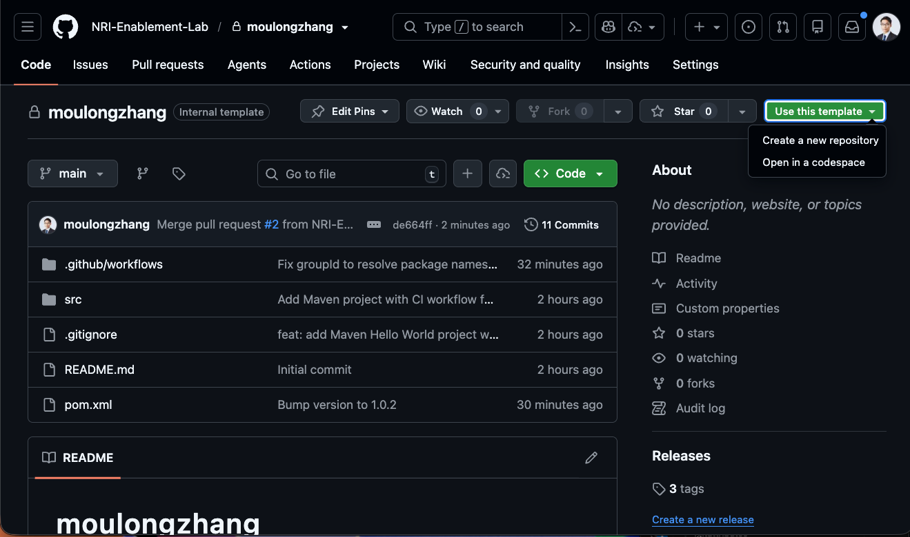
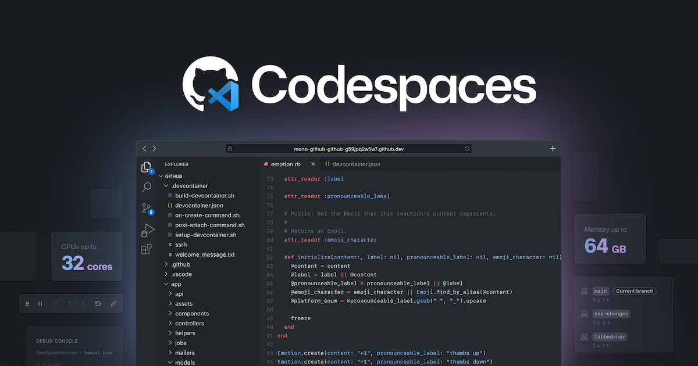
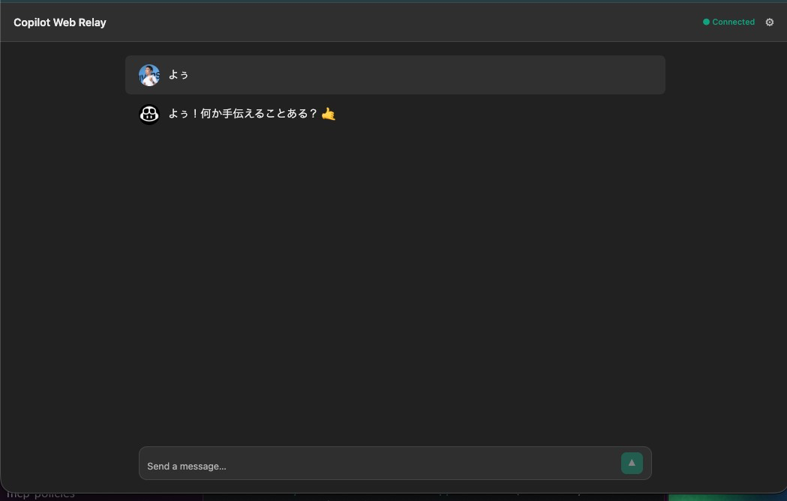
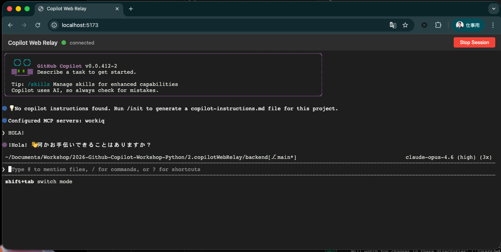

author: Your Name
summary: NRI GitHub Copilot Workshop
id: github-copilot-workshop
categories: AI, Development
environments: Web
status: Published
feedback link: https://example.com/feedback

# NRI GitHub Copilot Workshop

## About This Workshop
Duration: 5

Welcome to the GitHub Copilot Workshop!


### Today's Goals
- Agentic Workflow
- GitHub Copilot CLI

## Project Setup
Duration: 15

In this workshop, we will use the following GitHub repository:

**Project URL**: https://github.com/NRI-Enablement-Lab/moulongzhang

### Step 1: Create a Repository from the Template

First, open the project URL above in your browser and create your own repository from the template:

1. Open the project URL (https://github.com/NRI-Enablement-Lab/moulongzhang) in your browser
2. Click the **Use this template** button in the upper right and select **Create a new repository**



Once the template creation is complete, a new repository will be created under your GitHub account.

### Step 2: Set Up the Development Environment

Use the repository you created to set up a development environment with GitHub Codespaces:

1. Go to the page for the repository you created (`https://github.com/NRI-Enablement-Lab/[your-repository-name]`)
2. Click the green **Code** button
3. Select the **Codespaces** tab
4. Click **Create codespace on main**



## Agentic Workflow
Duration: 15

By combining GitHub Actions with Copilot, let's experience an Agentic Workflow that executes autonomous tasks.

### What is an Agentic Workflow?

An Agentic Workflow is a mechanism that leverages Copilot (AI) within GitHub Actions workflows to autonomously execute tasks in response to code changes.

### Creating Auto-Healing DevOps

Create a workflow that detects and fixes CI/CD job failures.

#### First Prompt

Enter the following prompt in Copilot:

```
Please create a GitHub Agentic Workflow by referencing the following URL.
https://github.com/github/gh-aw/blob/main/create.md

The purpose of the workflow is as follows:
Detect failed workflow runs in the repository, analyze their causes, and automatically create issues.
Automatically assign Copilot to the created issues.
```

#### Second Prompt

After creating the workflow, intentionally cause a build failure to verify that it works. Enter the following prompt in Copilot:

```
Change System.out.println("Hello World!"); to System.out.println("Hell World!"); and push the change.
```

After pushing, verify that the GitHub Actions workflow detects the failure and that Copilot automatically creates and is assigned to an issue.

### Automatically Updating Documentation

Create a workflow that automatically updates related documentation when code changes are made.

Enter the following prompt in Copilot:

```
Please create a GitHub Agentic Workflow by referencing the following URL.
https://github.com/github/gh-aw/blob/main/create.md

The purpose of the workflow is as follows:
- It runs when code under copilotWebRelay is updated
- It updates the documentation under copilotWebRelay/docs based on the code under copilotWebRelay, ensuring that source code and documentation are always in sync
```

## Let's Build the Copilot Web Relay
Duration: 10

From here, as an advanced section, we will build the **Copilot Web Relay** — a web application that allows you to access GitHub Copilot CLI from a browser.

In this section, we take a different approach from the Pomodoro timer. We will experience a workflow of **loading pre-prepared design documents into Copilot and implementing step by step through an interactive dialogue based on those documents**.



### What is Copilot Web Relay?

It is a web application that allows you to interact with your locally running GitHub Copilot CLI in real time through a browser UI, without directly operating the terminal.

### Architecture Overview

| Component | Tech Stack | Role |
|---|---|---|
| **Browser** | React + TypeScript + Vite | Terminal display (xterm.js), session management |
| **Backend Server** | Python (FastAPI) + WebSocket | Copilot CLI process management, WebSocket bridge |
| **CLI Bridge** | Python (asyncio + pexpect) | Copilot CLI PTY (pseudo-terminal) control, I/O streaming |

Browser ↔ WebSocket (bidirectional communication) ↔ Backend Server ↔ PTY/stdin/stdout (subprocess management) ↔ Copilot CLI

### Development Approach

In this section, we'll proceed as follows:

1. **Review the design document** — Review the design document distributed with the project and understand the overall picture of the application
2. **GitHub Copilot CLI** — Launch the CLI in the terminal and verify it works correctly
3. **AI-driven development** — Leverage the design document and implement the web application through Vibe Coding while interacting with GitHub Copilot CLI

> aside positive
>
> **Key Point of This Section**: The goal is to experience the quality and volume of tasks that can be achieved when combining Copilot's high-end models with GitHub Copilot's latest features. By preparing design documents in advance, you can clearly communicate the context of "what to build" to Copilot. In actual development workflows, leveraging design documents as Copilot context is a highly effective practice.

## Reviewing the Design Document and GitHub Copilot CLI
Duration: 15

### 1. Reviewing the Design Document

The design document for the Copilot Web Relay is distributed at `copilotWebRelay/planning.md` within the project. Start by opening this file to understand the overall picture of the application.

The design document includes the following:

- **Architecture**: Browser ↔ WebSocket ↔ FastAPI ↔ PTY ↔ Copilot CLI structure
- **Component Structure**: Frontend (React/TS), Backend (FastAPI), CLI Bridge (pexpect)
- **Feature Requirements**: Phase 1 (MVP) and Phase 2 (Enhanced Chat UI)
- **WebSocket Protocol Design**: Message format and state management specifications
- **Directory Structure**: File layout and the role of each file
- **Implementation Task List**: Dependencies between tasks
- **Important Implementation Notes**: Proactive measures for common pitfalls

> aside positive
>
> **Tips for Using the Design Document**: In the upcoming implementation phase, when sending prompts to GitHub Copilot CLI, adding the instruction `refer to planning.md` allows Copilot to generate code with full understanding of the design document context.

### 2. Launching GitHub Copilot CLI

Open the terminal in VS Code and enter the following command to launch GitHub Copilot CLI:

```bash
copilot
```

When it starts successfully, an interactive interface will appear. Type `/help` to see the available commands.

> aside negative
>
> **About GitHub Copilot CLI Setup**
> Normally, using GitHub Copilot CLI requires installing **GitHub CLI (`gh`)** and setting up the Copilot extension. In this workshop, **the DevContainer configuration includes GitHub Copilot CLI installation and authentication**, so the `copilot` command is available immediately when you launch Codespaces.
>
> To set up in your own environment, the following steps are required:
> 1. Install GitHub CLI: `brew install gh` (macOS)
> 2. Authenticate with GitHub CLI: `gh auth login`
> 3. Install the Copilot extension: `gh extension install github/copilot-cli`

### 3. GitHub Copilot CLI Command Reference

In GitHub Copilot CLI, you can type natural language instructions as text or use slash commands starting with `/`.

#### Code-related

| Command | Description |
|---|---|
| `/ide` | Connect to the IDE workspace |
| `/diff` | View change diffs in the current directory |
| `/review` | Run the code review agent to analyze changes |
| `/lsp` | Manage language server settings |
| `/terminal-setup` | Terminal setup for multiline input (Shift+Enter / Ctrl+Enter) |

#### Permissions

| Command | Description |
|---|---|
| `/allow-all` | Enable all permissions (tools, paths, URLs) |
| `/add-dir` | Add a permitted directory for file access |
| `/list-dirs` | List permitted directories |
| `/cwd` | Change or display the working directory |
| `/reset-allowed-tools` | Reset the list of allowed tools |

#### Session Management

| Command | Description |
|---|---|
| `/resume` | Switch to another session (specify session ID) |
| `/rename` | Rename the current session |
| `/context` | Display token usage of the context window |
| `/usage` | Display session usage metrics and statistics |
| `/session` | Display session information and workspace summary |
| `/compact` | Summarize conversation history to reduce context window usage |
| `/share` | Export session as a Markdown file or GitHub Gist |

#### Help & Feedback

| Command | Description |
|---|---|
| `/help` | Display help for interactive commands |
| `/changelog` | Display CLI version changelog |
| `/feedback` | Send feedback about the CLI |
| `/theme` | Check or set the terminal theme |
| `/experimental` | Display available experimental features, toggle experimental mode |

#### Others

| Command | Description |
|---|---|
| `/model` | Select the AI model to use (GPT, Claude, Gemini, etc.) |
| `/clear` , `/new` | Clear conversation history |
| `/plan` | Create an implementation plan before coding |
| `/instructions` | Display or toggle custom instruction files |
| `/diagnose` | Analyze current session logs |
| `/login` , `/logout` | Log in/out of Copilot |
| `/user` | Manage GitHub users |
| `/exit` , `/quit` | Exit the CLI |

#### Custom Instruction Files

Copilot CLI automatically loads custom instruction files from the following locations:

- `CLAUDE.md` / `GEMINI.md` / `AGENTS.md` (git root and current directory)
- `.github/instructions/**/*.instructions.md` (git root and current directory)
- `.github/copilot-instructions.md`
- `$HOME/.copilot/copilot-instructions.md`

> aside positive
>
> **CLI Tip**: You can switch models using the `/model` command. If implementation isn't progressing well, trying a different model may yield better results. The `/plan` command lets you automatically generate an implementation plan before coding, which is particularly effective when combined with a design document.

## Implement with Vibe Coding
Duration: 60

Now that you've reviewed the design document and verified GitHub Copilot CLI is working, it's time to implement the Copilot Web Relay with **Vibe Coding**.

Simply execute the following 4 steps in order, and Copilot will build the application based on the design document.

### Step 1: Launch Copilot CLI

Launch Copilot CLI in the VS Code terminal.

```bash
copilot
```

### Step 2: Allow All Permissions

```
/allow-all
```

`/allow-all` is a command that grants **all permissions at once for tool execution, file access, and external URL access** to Copilot CLI.

Normally, Copilot CLI prompts the user for permission each time it reads or writes files, executes commands, or communicates externally for security purposes. Running `/allow-all` skips these confirmation prompts, allowing Copilot to autonomously create and edit files, install packages, start servers, and more.

> aside negative
>
> **Note**: `/allow-all` is only effective for the current session. For security reasons, only use it with trusted projects. If you prefer to grant permissions individually, you can also use `/add-dir` to set directory-level access permissions.

### Step 3: Select a High-end Model

```
/model Claude Opus 4.6
```

Select the most powerful model available. Copilot CLI lets you switch AI models with the `/model` command, allowing you to choose the optimal model based on task complexity. For building a web application with multiple components like this one, a high-end model with strong reasoning capabilities is most effective.

### Step 4: Implement Everything at Once with Fleet Mode

```
/fleet Build Copilot Web Relay — a web application that allows accessing GitHub Copilot CLI from a browser. Please follow the plan in copilotWebRelay/planning.md for implementation. If anything is unclear, please ask me first.
```

`/fleet` is a command that **launches multiple sub-agents in parallel to divide and concurrently execute large tasks**.

In normal Copilot CLI, tasks are processed one at a time sequentially, but with `/fleet`, Copilot automatically breaks down tasks and **progresses multiple work items simultaneously** — such as backend implementation, frontend implementation, and configuration file creation. This allows you to complete in a single instruction what previously required giving instructions one by one.

In Fleet Mode, the following happens automatically:

- **Task decomposition**: Reads the design document and identifies components to implement
- **Parallel implementation**: Simultaneously implements Backend (FastAPI + CLI Bridge + WebSocket) and Frontend (React + xterm.js)
- **Dependency resolution**: Package installation, configuration file generation
- **Integration testing**: Verification after implementation

> aside positive
>
> **Fleet Mode Tips**: If Copilot asks questions, respond appropriately. For content described in the design document, responding with "please refer to planning.md" is also effective. Implementation progress is displayed in real time in the terminal.

### Hints If You Get Stuck

If errors occur during Fleet Mode implementation, try the following:

- **Share the error message directly with Copilot**: Simply saying "Please fix this error" is often enough
- **Check changes with `/diff`**: Verify there are no unintended changes
- **Switch models with `/model`**: Try a different model and retry
- **Review the design document notes**: The "Important Implementation Notes" section in `planning.md` contains solutions for common bugs

> aside negative
>
> **Common Pitfalls**:
> - **Vite WebSocket proxy**: You need to specify `http://` instead of `ws://` for the `target`
> - **React StrictMode**: `useEffect` running twice can cause unstable WebSocket connections
> - **FastAPI routing order**: StaticFiles mount must be defined after WebSocket endpoints
> - **xterm.js v5 package name**: Use `@xterm/addon-fit` instead of `xterm-addon-fit`

Below is my implementation result from a single-shot prompt.



## Understand & Improve the Code
Duration: 20

Let's have Copilot explain the code from the Vibe Coding implementation of Copilot Web Relay to deepen our understanding. Then we'll find issues and implement improvements.

### 1. Request an Explanation of the Entire Codebase

First, let's get an overview of the implemented code. Enter the following prompt in Agent Mode:

```
Please review the entire codebase of this Copilot Web Relay application and explain the architecture, the role of each file, and the main processing flows.
```

The Copilot agent will automatically scan files in the project and explain the code structure and processing flows.

> aside positive
>
> **Tip**: In Agent Mode, Copilot automatically references files within the project when answering, so you don't need to manually add files to the context.

### 2. Identify Issues

Next, let's have Copilot identify issues from a code quality and security perspective:

```
Looking at this Copilot Web Relay application as a whole, what issues or areas for improvement do you see? Please analyze from the perspectives of design patterns, code quality, maintainability, and security.
```

You can also drill down into specific components:

```
Are there any issues with the error handling and resource management in backend/cli_bridge.py? Please suggest improvements.
```

```
Are there any issues with the WebSocket connection management in frontend/src/App.tsx? Please check whether it follows React best practices.
```

### 3. Implement the Improvements

Let's have Copilot actually fix the issues found:

```
Please implement all of the improvements you suggested.
```

Copilot will propose changes directly to the code. Review the changes and use the "Keep" or "Undo" buttons in the chat to decide whether to accept them.

### 4. Verify Functionality

After implementing improvements, verify that the application continues to work correctly:

```
Please verify that the application works correctly after implementing the improvements. Start the backend, build the frontend, and verify operation in the browser.
```

> aside positive
>
> **Important**: In Agent Mode, Copilot operates more autonomously, so be sure to carefully review the proposed changes before accepting them. The agent may also automatically detect and attempt to fix errors that occur after code changes.

## Congratulations 🎉
Duration: 5

### What You Learned Today

In this workshop, you learned the following:

1. **Basic usage of GitHub Copilot**
2. **Code explanation and improvement with Agent Mode**
3. **Spec-driven development — controlling AI while implementing**
4. **AI-driven development using powerful models and tools**

### Next Steps

- Try using Copilot in your actual projects
- Take on more complex application development
- Keep up with Copilot's new features
- Deploy the Copilot Web Relay to your own environment

### Resources

- [GitHub Copilot Documentation](https://docs.github.com/copilot)
- [GitHub Copilot Best Practices](https://docs.github.com/copilot/using-github-copilot/best-practices-for-using-github-copilot)

Great work!
