author: Your Name
summary: GitHub Copilot Workshop
id: github-copilot-workshop
categories: AI, Development
environments: Web
status: Published
feedback link: https://example.com/feedback

# GitHub Copilot Workshop

## About This Workshop
Duration: 5

Welcome to the GitHub Copilot Workshop! In this workshop, you will learn how to use GitHub Copilot to explain and improve code.
GitHub Copilot Chat allows you to interact with AI through a chat experience. Let's learn how to use GitHub Copilot through this workshop!


### Today's Goals
- Understand the various features of GitHub Copilot
- Use Agent Mode to develop a new application from scratch

### Prerequisites
- Visual Studio Code is installed
- You have a GitHub Copilot license
- You have a GitHub account

## Project Setup
Duration: 15

In this workshop, we will use the following GitHub repository:

**Project URL**: https://github.com/moulongzhang/2026-Github-Copilot-Workshop-Python

### Step 1: Create a Repository from the Template

First, open the project URL above in your browser and create your own repository from the template:

1. Open the project URL (https://github.com/moulongzhang/2026-Github-Copilot-Workshop-Python) in your browser
2. Click the **Use this template** button in the upper right and select **Create a new repository**


3. On the repository creation screen, enter a repository name and click the **Create repository** button


> aside negative
>
> **⚠️ Important**: When creating the repository, make sure to select **"Public"** for the **Visibility** setting. Some Copilot features and GitHub Actions may not work correctly with private repositories.

Once the template creation is complete, a new repository will be created under your GitHub account.

### Step 2: Set Up the Development Environment

Use the repository you created to set up a development environment with GitHub Codespaces:

1. Go to your repository page (`https://github.com/[your-username]/2026-Github-Copilot-Workshop-Python`)
2. Click the green **Code** button
3. Select the **Codespaces** tab
4. Click **Create codespace on main**


> aside positive
>
> **Tip**: Using Codespaces launches a VS Code-like environment in your browser, allowing you to start development immediately. This project includes a `.devcontainer/devcontainer.json` file that automatically configures the following when Codespaces starts:
> - **Python 3.11 environment**: The Python environment needed for development
> - **GitHub Copilot extension**: AI-powered code completion and chat features
> - **CodeTour extension**: Guided tour functionality for the project

## Let's Build a Pomodoro Timer
Duration: 30

So far, you have learned the basic ways to use GitHub Copilot in VS Code. Now let's actually develop an application.

In this hands-on session, we will develop a Pomodoro timer application. This application will have the ability to set work and break durations and manage a timer.

We aim to create an application with a UI like the one below.

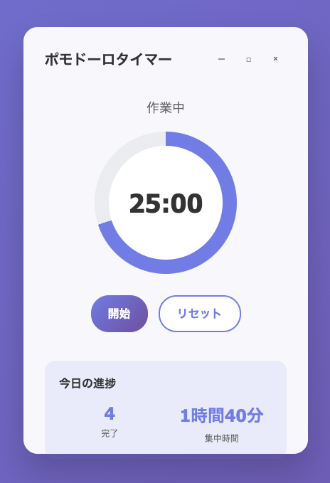

First, let's create a new Python file in VS Code. Since we want to create this as a web application, we'll use Flask. Let's name the main file "app.py".

### Project Overview

We will create a web timer application for the Pomodoro Technique.

### Required Features
- 25-minute work timer
- 5-minute break timer
- Start, stop, and reset the timer
- Progress display and statistics
- Browser notifications and sound alerts
- Responsive Web UI

> aside positive
>
> **What is a Pomodoro Timer?**: The Pomodoro Technique is a time management method devised by Francesco Cirillo in the 1980s. It involves working in sets of "25 minutes of work + 5 minutes of break" (= 1 Pomodoro), repeating this cycle to maintain focus and work efficiently. For more details, see [Wikipedia: Pomodoro Technique](https://en.wikipedia.org/wiki/Pomodoro_Technique).

## Thinking Through the Pomodoro Timer Design
Duration: 10

Rather than jumping straight into implementation, let's first consult Copilot about the approach and design to follow. From here on, we will proceed entirely in Agent Mode.

### Switching to Agent Mode

Select "Agent" from the Copilot Chat mode selector. The agent understands user intent and can execute tasks more autonomously.

<div align="center">
  
  
  <div style="height: 24;"></div>
  
  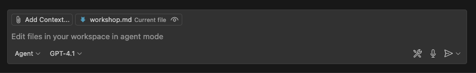
</div>

### Design Consultation

When creating a web application with a UI like this, a useful feature is the ability to upload images to Copilot Chat. This allows Copilot to understand the UI image of your application.

First, save the UI image from the previous page as `pomodoro.png` in the project root. Then click `Add Context` in the chat input area and select "Image from Clipboard" or "Files & Folders...". Then select the UI image.


Once the image is uploaded, it will appear in the Copilot Chat window.

Now, try entering the following prompt.

```
I plan to create a Pomodoro timer web app for this project. The attached image is the UI mock for the app. Please propose an architecture recommendation for building this app using Flask and HTML/CSS/JavaScript.
```

Copilot will then suggest a recommended web application architecture.

If you see areas for improvement or points that haven't been considered in this architecture, go ahead and point them out. For example:

```
Considering ease of unit testing, please identify any improvements or additions needed in the current architecture.
```

Once the architecture design is finalized through this exchange, let's save the content to a file. This way, you can reference the same architecture content even when opening a new chat session.

```
The architecture has been finalized through our conversation so far. Based on our discussion, please create a file called architecture.md in the project root that summarizes the web application architecture proposal.
```

> aside positive
>
> When you reach a good stopping point in your Copilot Chat conversation, starting a new conversation allows you to give Copilot clearer instructions. To start a new conversation, click the "New Conversation" button at the top of the chat window. When doing so, it's helpful to save content you want to reference in future chats — like this architecture document — to a file, as we did here.


## Let's Identify What Needs to Be Done
Duration: 10

At this point, the UI mock and architecture design are finalized. Let's consider what specific features need to be implemented. We'll consult Copilot Chat about this as well. Be sure to attach pomodoro.png and architecture.md.

```
Please identify all the features that need to be implemented to create this Pomodoro timer application.
```


Refine this content through your conversation with Copilot. Once finalized, save this content to a file called features.md, just as we did with the architecture.

```
Thank you. That looks good, so please write the list of features to implement in a file called features.md.
```

Now, before we start implementing, a key tip for using Copilot effectively is to avoid trying to implement large features all at once. Instead, start with small features first. This improves the accuracy of the code Copilot suggests, allowing for smoother development.

Let's also consult Copilot about how to break down this application development into appropriate increments. Here, attach pomodoro.png, architecture.md, and features.md.

```
I want to implement this Pomodoro timer application incrementally. Based on the attached image, architecture, and feature list, please propose a step-by-step implementation plan with appropriate granularity.
```

When I tried this, Copilot proposed a plan consisting of 6 steps. If there's anything you'd like to change, go ahead and tell Copilot. Then, save this content to a file called plan.md so you can reference it later. Think about what prompt you should use to give this instruction.

## Let's Implement
Duration: 30

With all the preparation in place, it's time to start implementing. Follow the implementation plan proposed in the previous step and implement features incrementally.

### 1. Preparing the Branch

Before starting implementation, let's create a working branch.

#### Step 1: Reset Staged Changes

Restore all currently staged changes back to the working directory:

```bash
git restore .
```

#### Step 2: Create a New Branch

Create and switch to the feature/pomodoro branch:

```bash
git checkout -b feature/pomodoro
```

### 2. Preparing the Project Structure

First, let's create the directory structure for the project according to our architecture.

Start by modifying the current project folder structure to support the architecture described in `architecture.md`. Move files and update configuration files as needed.

Then, attach `pomodoro.png`, `architecture.md`, and `plan.md`, and give Copilot the following instruction:

```
Please implement Step 1 of plan.md. If any existing files in this project need to be moved to different directories, please do that as well. If there are any additional considerations, please ask me.
```

In my case, Copilot came back with questions that needed consideration, as shown below. In such cases, provide the necessary information.

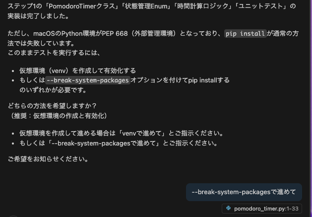

After that, Copilot proceeds with the Step 1 implementation. Once implementation is complete, Copilot will autonomously build the project and check for errors. If errors occur, it will make additional fixes to resolve them. This autonomous behavior is a key characteristic of Agent Mode.

Once implementation is complete, verify the following:

1. **Directory structure**: Does it follow the recommended architecture?
2. **Base files**: Have the necessary base files (app.py, HTML templates, CSS files, etc.) been created?
3. **Functionality check**: Run a quick test to make sure there are no errors

Below is an example of my Step 1 implementation result. The state of your application at this stage will likely differ.


## Let's Write Tests
Duration: 20

Before continuing with implementation, let's write unit tests for the features we've implemented so far. Writing unit tests ensures that changes in later steps don't break existing functionality.

If unit tests were already implemented in the previous step, you can skip this page.

### Implementing Tests

Try running the following prompt.

```
There are currently no unit tests for the existing implementation. Please implement unit tests.
```

Copilot's agent will then ask for permission to execute commands to install unit test dependencies. Like this, the agent always asks the user for confirmation before executing any command. Click "Continue" to allow it to run the necessary commands.

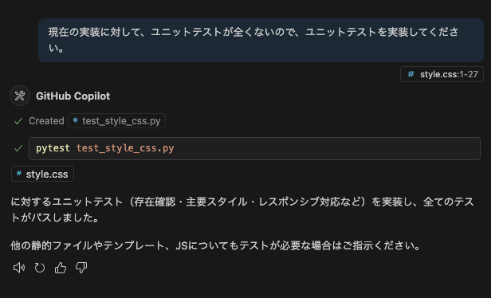

Copilot will then execute the command in VS Code's terminal and install the required dependencies. Similarly, for all subsequent commands, the agent will always ask the user for confirmation before execution. If an error occurs from running a command, the agent will make additional fixes to resolve it.


## Configuration for the Next Tasks
Duration: 20

In the following steps, we will use Copilot features on GitHub.com and the Coding Agent. Let's configure the necessary settings.

### 1. GitHub Advanced Security (GHAS) Configuration

Enabling the Code Scanning feature of GitHub Advanced Security allows you to automatically detect code vulnerabilities.

1. Click the **Settings** tab in your repository
2. Select **Security** → **Code security** from the left sidebar
3. Click **Set up** in the **Code scanning** section


4. Select **Default** (recommended)


5. Click **Enable CodeQL**

This will enable automatic code scanning on push and pull request creation.

### 2. Enabling Copilot Features

Let's enable the Copilot features available on GitHub.

1. Click your profile icon in the upper right of GitHub
2. Select **Your Copilot**


Enable the following features:

- **Editor preview features** - Preview features for the editor
- **Copilot CLI** - Use Copilot in the terminal
- **Copilot code review** - Code review feature
- **Copilot coding agent** - Autonomous coding agent

> aside negative
>
> **Plan Limitations**: Advanced features such as Copilot Code Review, Coding Agent, and Copilot CLI are only available with GitHub Copilot Business/Enterprise plans. These features are not available on the Free plan.

### 3. Enable Issues and Actions in Your Repository

> **⚠️ This step is only for users whose Issues or Actions are disabled.** Skip this if they are already enabled.

Repositories created from templates may have Issues and Actions disabled by default. Since we'll use them in later steps, enable them if they're currently disabled.

#### Enabling Issues

1. Click the **Settings** tab in your repository
2. Check the **Features** section under **General**
3. Check the box for **Issues**

#### Enabling Actions

1. Click the **Actions** tab in your repository
2. Click "I understand my workflows, go ahead and enable them" to enable

### 4. Creating a Personal Access Token (PAT) (Optional)

Create a Personal Access Token so that the Coding Agent can operate within GitHub Actions.

#### Step 1: Create a Fine-grained PAT

Visit the following URL to create a new Fine-grained PAT:

[https://github.com/settings/personal-access-tokens/new](https://github.com/settings/personal-access-tokens/new)

Configuration:
- **Token name**: Enter any name you like (e.g., `copilot-workshop`)
- **Resource owner**: Select your personal user account (not an organization)
- **Repository access**: Select **Public repositories** (select Public repositories even if adding to a private repository)
- **Permissions**: Enable **Copilot Requests**


After creation, make sure to copy the displayed PAT.

> **⚠️ Note**: The PAT is only displayed on the screen immediately after creation. It cannot be viewed again after navigating away, so be sure to copy it at this time.

#### Step 2: Set as a GitHub Actions Repository Secret

Set the created PAT as a repository secret:

1. Click the **Settings** tab in your repository
2. Select **Secrets and variables** → **Actions** from the left sidebar
3. Click **New repository secret**
4. Enter the following:
   - **Name**: `COPILOT_GITHUB_TOKEN`
   - **Value**: Paste the PAT you just created
5. Click **Add secret**

#### Step 3: Verify Workflow Permissions

Verify the Actions workflow permissions so the Coding Agent can automatically create Pull Requests:

1. Click the **Settings** tab in your repository
2. Select **Actions** → **General** from the left sidebar
3. In the **Workflow permissions** section, verify that **Allow GitHub Actions to create and approve pull requests** is checked
4. If not checked, enable it and click **Save**

> aside positive
>
> **Tip**: This setting allows the Copilot Coding Agent to use Copilot's capabilities within GitHub Actions workflows.

## Implement the Remaining Features (Optional)
Duration: 20

This section is **optional**. Proceed if you have already learned the basic Copilot features and want to try more advanced implementations.

From here, let's implement the remaining features step by step as a free-form exercise.

Here are some tips that should be helpful.

### When You Want to Give Instructions About the UI

If you want to give instructions about specific UI elements, you can upload a screenshot of the UI to Copilot so it can recognize those elements. When doing so, it helps to circle or draw arrows on the screenshot to clearly indicate which elements you're referring to.

Alternatively, you can upload two screenshots — one showing the current state and one showing the expected state — to have Copilot identify the differences and make the UI match the expected design as closely as possible.

### When You Find Yourself Giving the Same Instructions Repeatedly

If you frequently give the same types of instructions when writing prompts or specifying context, you can have Copilot remember those instructions. Specifically, create a file called `.github/copilot-instructions.md` in your project and write the instructions there. When this file exists, Copilot automatically reads it and references those instructions in subsequent chats.

Below is a sample of custom instructions.

```markdown
This project implements a Pomodoro timer using Flask.

The following are important files in the project. Please reference these files as needed when responding to user instructions.
 - `pomodoro.png`: The UI mock for the application.
 - `architecture.md`: The application's architecture document.
 - `features.md`: The list of features to implement.
 - `plan.md`: The step-by-step implementation plan.
```

You can also include project-specific commands such as build and test commands, and Copilot will automatically use them.

### When Implementation Gets Stuck or You Can't Resolve a Bug

In such cases, try the following approaches:

- Instruct Copilot to output debug information, then have it analyze the output.
- Try a different model.

## Commit and Push to Git
Duration: 10

Let's commit the code you've created to the Git repository and push it to a remote branch. Here are two methods.

### Method A: Using Terminal Commands

The traditional method of running Git commands directly in the terminal:

```
git add .
git commit -m "Add Pomodoro timer feature"
git push origin feature/pomodoro
```

### Method B: Creating a Commit with Generative AI

Use Agent Mode to instruct Copilot directly to commit and push. Run the following prompt:

```
I've finished creating the feature. Please stage the code changes in git.

Then, please commit with an appropriate commit message and push the changes to the remote branch.
```

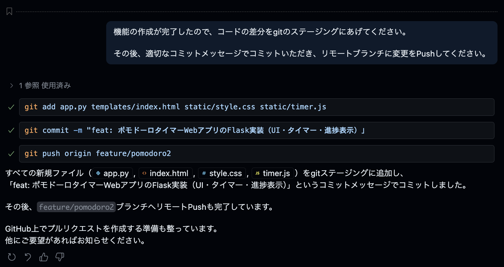

#### [Optional] Auto-creating GitHub Issues via MCP Server

Next, you can also use MCP Server to manage your implementation plan as GitHub Issues.

> aside negative
>
> **Note**: If the GitHub MCP server is not enabled, start the MCP server from the `.vscode/mcp.json` file:
>
> ```json
> {
>   "servers": {
>     "github-mcp-server": {
>       "type": "http",
>       "url": "https://api.githubcopilot.com/mcp/"
>     }
>   }
> }
> ```

```
Please create GitHub issues for each step in plan.md.
```

This instruction causes Copilot to:

1. Read the contents of `plan.md`
2. Create individual Issues for each step
3. Each Issue will include:
   - Step title and detailed description
   - Feature requirements to implement
   - Acceptance criteria
   - Appropriate labels and priority

This enables planned project management and agile development.

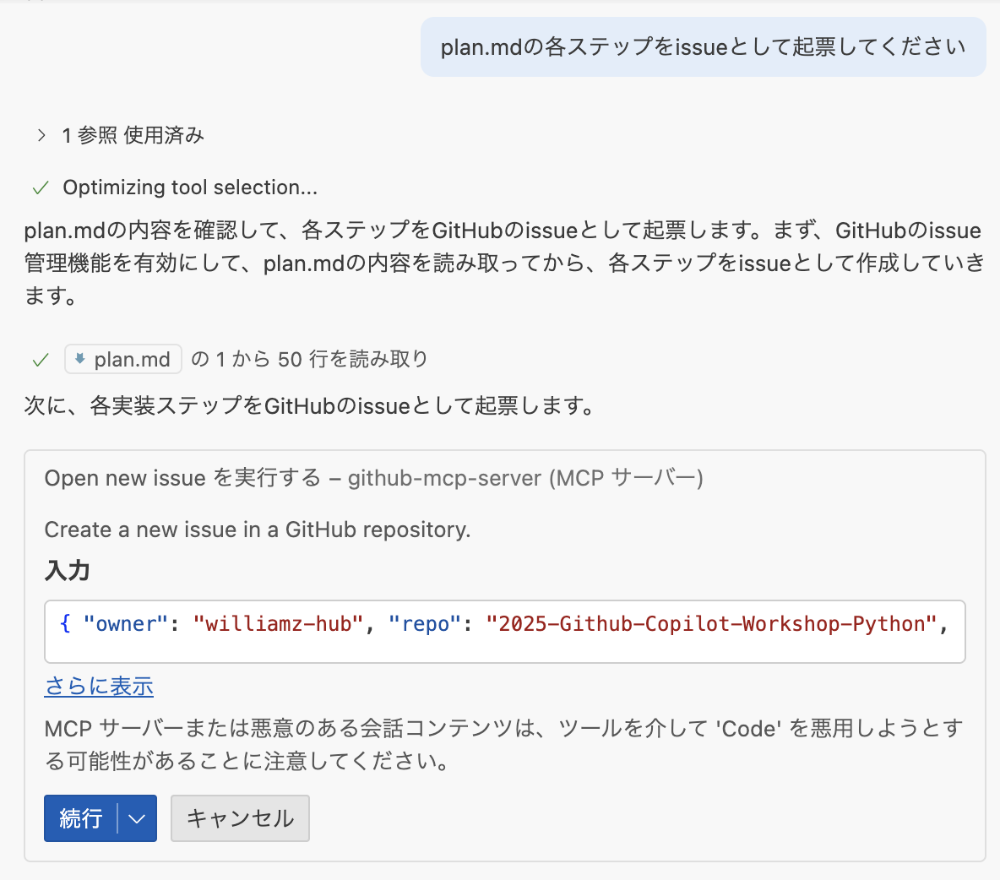

> aside positive
>
> **Benefits of MCP**: By using the GitHub MCP server, Copilot can directly access GitHub metadata such as repository information, Issues, Pull Requests, and branch information, enabling more detailed analysis and suggestions.

## [GitHub.com] Copilot Code Review
Duration: 15

After pushing, let's create a Pull Request on GitHub.com and leverage Copilot's code review features.

### Creating a Pull Request and Copilot Summary

1. Go to your repository on GitHub
2. Click **Open a pull request**
3. On the Pull Request creation screen, click **Copilot icon** >> **Summary**


Copilot will automatically generate a summary of the Pull Request.

### Assigning Copilot as a Reviewer

In the **Reviewers** section, assign **Copilot** to request a code review from Copilot.

> aside positive
>
> **Auto-assign Setting**: By going to Settings >> Branches >> Rulesets >> Require a pull request before merging >> Automatically request Copilot code review, Copilot will be automatically assigned when a Pull Request is opened.


### Reviewing Copilot Code Review Results

After the Pull Request is opened, you can view the Copilot Code Review results:

- **Pull Request Overview**: Summary of code changes
- **Issues Found**: Identification of potential problems
- **Improvement Suggestions**: Specific suggestions for improving code quality


### Static Vulnerability Scanning with GitHub Advanced Security

The Pull Request also displays results from GitHub Advanced Security (GHAS) static vulnerability scanning:

#### Reviewing Security Alerts


- **High-severity Vulnerabilities**: Critical security issues
- **Copilot Autofix**: AI-powered automatic fix suggestions
- **Detailed Explanations**: Vulnerability details and remediation methods

#### Check Results Details

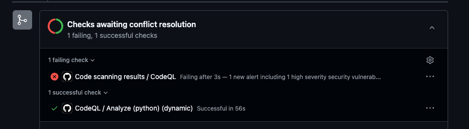

> aside positive
>
> **Leveraging Copilot Autofix**: GitHub provides Copilot Autofix automatic fix suggestions for detected security vulnerabilities. This allows you to quickly resolve security issues.

## [GitHub.com] Copilot Coding Agent
Duration: 20

Let's use the GitHub Copilot web interface to automatically generate improvement proposals as Issues and leverage the Coding Agent.

### Auto-creating Issues with GitHub Copilot

1. Go to **GitHub.com** and click the **Copilot** icon in the upper right
2. Verify that your repository is added to the Chat context
3. Enter the following prompt:

```
Please create 3 issues for customizing the Pomodoro timer.

Pattern A: Enhanced Visual Feedback

Circular progress bar animation: Smooth decreasing animation based on remaining time
Color changes: Gradient transition from blue → yellow → red as time progresses
Background effects: Particle effects or ripple animations in the background during focus time
Test purpose: Measure the impact of visual immersion on user concentration

Pattern B: Improved Customizability

Flexible time settings: Choose from 15/25/35/45 minutes instead of a fixed 25 minutes
Theme switching: Dark/Light/Focus mode (minimal)
Sound settings: Toggle start/end/tick sounds on/off
Custom break duration: Choose from 5/10/15 minutes
Test purpose: Measure the impact of personalized settings on user retention

Pattern C: Gamification Elements

Experience point system: XP and level-ups based on completed Pomodoros
Achievement badges: Accomplishment system for "3 consecutive days", "10 completions this week", etc.
Weekly/monthly statistics: More detailed graph displays (completion rate, average focus time, etc.)
Streak display: Consecutive day count display
Test purpose: Measure the impact of gamification elements on motivation and continued usage
```

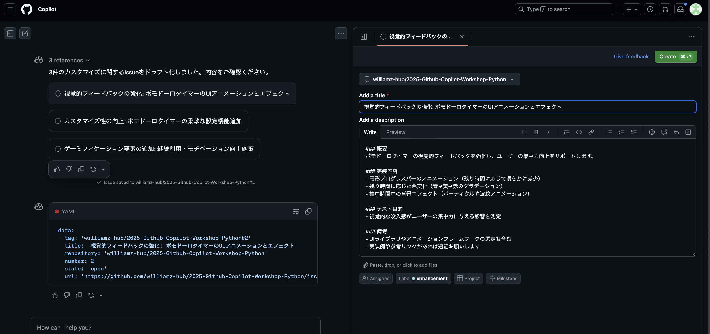

### Creating Issues and Assigning the Coding Agent

1. **Copilot will automatically generate 3 Issues**
2. Review the content of each Issue and edit as needed
3. Click the **Create** button to create each Issue
4. After navigating to the Issue page, select **Copilot** in the **Assignees** section to assign the Coding Agent

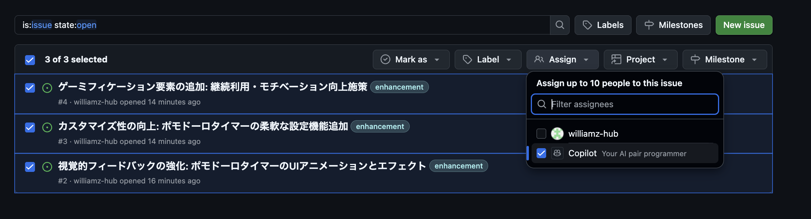

### Expected Pull Request Results

Once the Coding Agent is assigned, you can expect the following results:

- **Automatic code implementation**: Feature implementation based on each Issue's requirements
- **Pull Request creation**: Automatic PR creation after implementation is complete
- **Comprehensive tests**: Including both unit tests and UI tests

#### Pattern A: Enhanced Visual Feedback


#### Pattern B: Improved Customizability

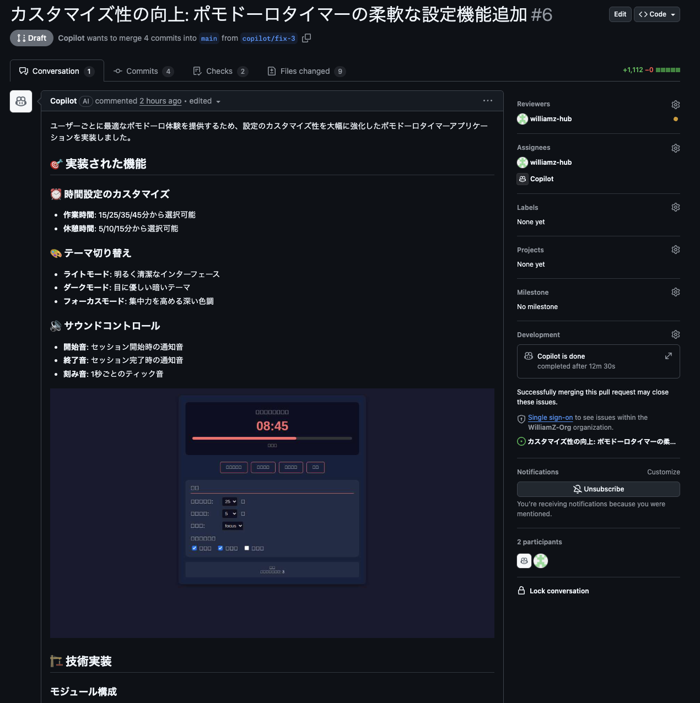

#### Pattern C: Gamification Elements

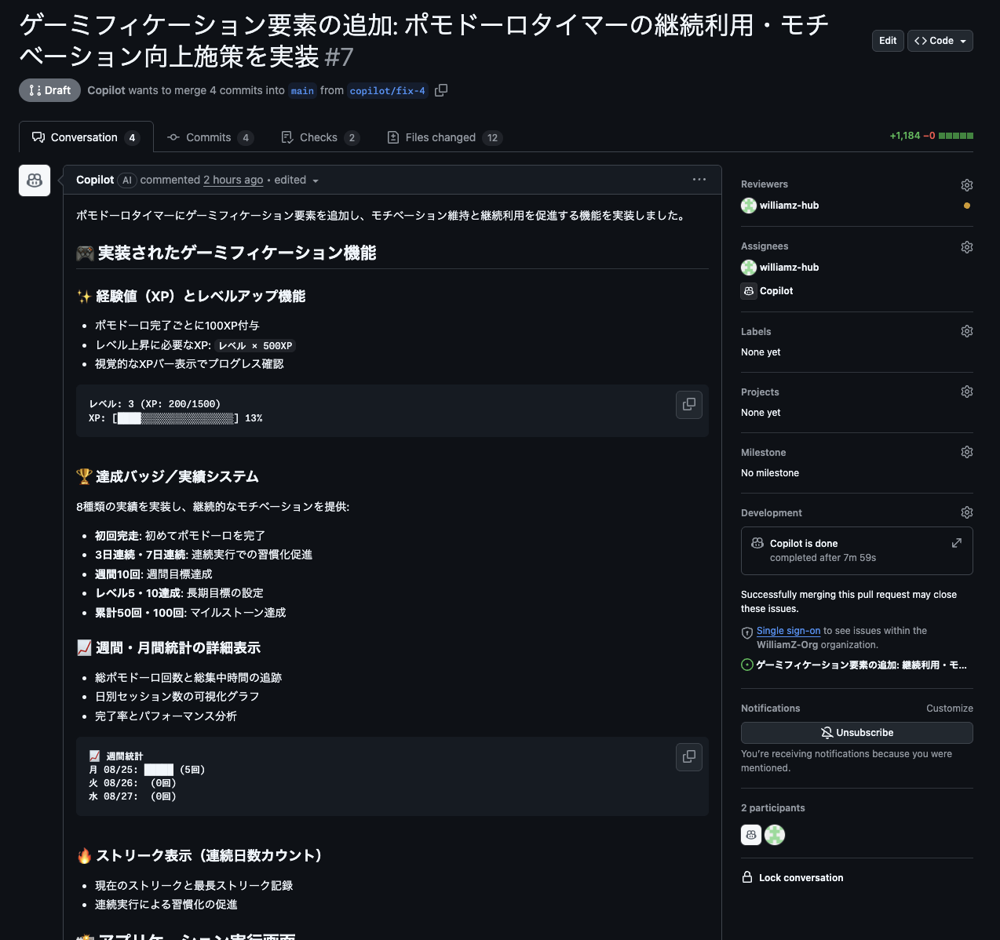

> aside positive
>
> **Leveraging MCP Server**: The GitHub MCP Server and Playwright MCP Server are included in the Coding Agent's initial setup. This enables not only unit tests but also automated UI verification through screenshots. The Coding Agent visually verifies that implemented features work as expected, delivering higher quality code.

## [GitHub.com] Agentic Workflow
Duration: 15

By combining GitHub Actions with Copilot, let's experience an **Agentic Workflow** that detects code changes and automatically updates documentation.

### What is an Agentic Workflow?

An Agentic Workflow is a mechanism that leverages Copilot (AI) within GitHub Actions workflows to autonomously execute tasks in response to code changes. In this workshop, a workflow has been pre-configured to automatically update related documentation when changes are made to the Pomodoro timer code.

### 1. Merge the Pull Request into the Main Branch

Merge the Pull Request created in the previous step into the main branch.

1. Go to your repository on GitHub
2. Click the **Pull requests** tab
3. Open the target Pull Request
4. Click the **Merge pull request** button to merge

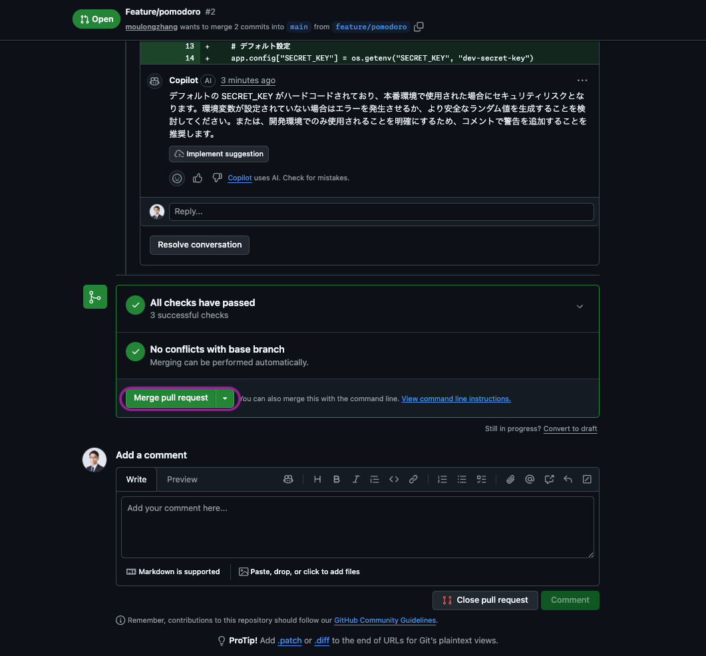

### 2. Verify the Workflow Execution

The Agentic Workflow was automatically triggered when you pushed the code.

1. Go to your repository on GitHub
2. Click the **Actions** tab
3. Verify that the **Pomodoro Documentation Sync** workflow is running


This workflow automatically updates the documentation managed under `pomodoro/docs/` based on the changes whenever there are diffs in the code under `pomodoro/`.

### 3. Review the Pull Request

Once the Actions run completes, a **Pull Request** to update the documentation is automatically created.

1. Click the **Pull requests** tab
2. Review the PR created by Copilot
3. Review the documentation changes

### 4. Create Your Own Agentic Workflow

Now that you've seen the Agentic Workflow in action, let's create your own.

Run the following prompt in Agent Mode:

```
Please create a GitHub Agentic Workflow by referencing the following URL.
https://github.com/github/gh-aw/blob/main/create.md

The purpose of the workflow is as follows:
- It runs when code under copilotWebRelay is updated
- It updates the documentation under copilotWebRelay/docs based on the code under copilotWebRelay, ensuring that source code and documentation are always in sync
```

> aside positive
>
> **Possibilities of Agentic Workflows**: Beyond documentation updates, you can build Agentic Workflows for various tasks such as automatic test generation, automated code reviews, and release note creation.

## Let's Build the Copilot Web Relay
Duration: 10

From here, as an advanced section, we will build the **Copilot Web Relay** — a web application that allows you to access GitHub Copilot CLI from a browser.

In this section, we take a different approach from the Pomodoro timer. We will experience a workflow of **loading pre-prepared design documents into Copilot and implementing step by step through an interactive dialogue based on those documents**.

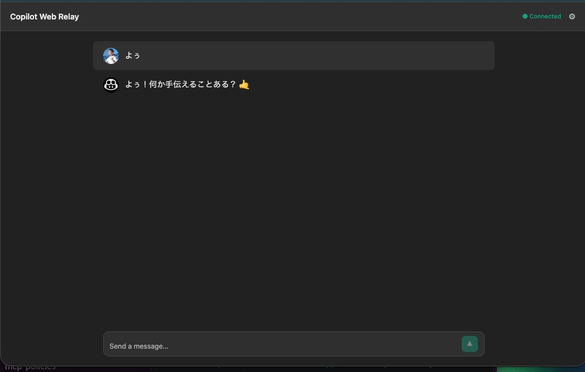

### What is Copilot Web Relay?

It is a web application that allows you to interact with your locally running GitHub Copilot CLI in real time through a browser UI, without directly operating the terminal.

### Architecture Overview

| Component | Tech Stack | Role |
|---|---|---|
| **Browser** | React + TypeScript + Vite | Terminal display (xterm.js), session management |
| **Backend Server** | Python (FastAPI) + WebSocket | Copilot CLI process management, WebSocket bridge |
| **CLI Bridge** | Python (asyncio + pexpect) | Copilot CLI PTY (pseudo-terminal) control, I/O streaming |

Browser ↔ WebSocket (bidirectional communication) ↔ Backend Server ↔ PTY/stdin/stdout (subprocess management) ↔ Copilot CLI

### Development Approach

In this section, we'll proceed as follows:

1. **Review the design document** — Review the design document distributed with the project and understand the overall picture of the application
2. **GitHub Copilot CLI** — Launch the CLI in the terminal and verify it works correctly
3. **AI-driven development** — Leverage the design document and implement the web application through Vibe Coding while interacting with GitHub Copilot CLI

> aside positive
>
> **Key Point of This Section**: The goal is to experience the quality and volume of tasks that can be achieved when combining Copilot's high-end models with GitHub Copilot's latest features. By preparing design documents in advance, you can clearly communicate the context of "what to build" to Copilot. In actual development workflows, leveraging design documents as Copilot context is a highly effective practice.

## Reviewing the Design Document and GitHub Copilot CLI
Duration: 15

### 1. Reviewing the Design Document

The design document for the Copilot Web Relay is distributed at `copilotWebRelay/planning.md` within the project. Start by opening this file to understand the overall picture of the application.

The design document includes the following:

- **Architecture**: Browser ↔ WebSocket ↔ FastAPI ↔ PTY ↔ Copilot CLI structure
- **Component Structure**: Frontend (React/TS), Backend (FastAPI), CLI Bridge (pexpect)
- **Feature Requirements**: Phase 1 (MVP) and Phase 2 (Enhanced Chat UI)
- **WebSocket Protocol Design**: Message format and state management specifications
- **Directory Structure**: File layout and the role of each file
- **Implementation Task List**: Dependencies between tasks
- **Important Implementation Notes**: Proactive measures for common pitfalls

> aside positive
>
> **Tips for Using the Design Document**: In the upcoming implementation phase, when sending prompts to GitHub Copilot CLI, adding the instruction `refer to planning.md` allows Copilot to generate code with full understanding of the design document context.

### 2. Launching GitHub Copilot CLI

Open the terminal in VS Code and enter the following command to launch GitHub Copilot CLI:

```bash
copilot
```

When it starts successfully, an interactive interface will appear. Type `/help` to see the available commands.

> aside negative
>
> **About GitHub Copilot CLI Setup**
> Normally, using GitHub Copilot CLI requires installing **GitHub CLI (`gh`)** and setting up the Copilot extension. In this workshop, **the DevContainer configuration includes GitHub Copilot CLI installation and authentication**, so the `copilot` command is available immediately when you launch Codespaces.
>
> To set up in your own environment, the following steps are required:
> 1. Install GitHub CLI: `brew install gh` (macOS)
> 2. Authenticate with GitHub CLI: `gh auth login`
> 3. Install the Copilot extension: `gh extension install github/copilot-cli`

### 3. GitHub Copilot CLI Command Reference

In GitHub Copilot CLI, you can type natural language instructions as text or use slash commands starting with `/`.

#### Code-related

| Command | Description |
|---|---|
| `/ide` | Connect to the IDE workspace |
| `/diff` | View change diffs in the current directory |
| `/review` | Run the code review agent to analyze changes |
| `/lsp` | Manage language server settings |
| `/terminal-setup` | Terminal setup for multiline input (Shift+Enter / Ctrl+Enter) |

#### Permissions

| Command | Description |
|---|---|
| `/allow-all` | Enable all permissions (tools, paths, URLs) |
| `/add-dir` | Add a permitted directory for file access |
| `/list-dirs` | List permitted directories |
| `/cwd` | Change or display the working directory |
| `/reset-allowed-tools` | Reset the list of allowed tools |

#### Session Management

| Command | Description |
|---|---|
| `/resume` | Switch to another session (specify session ID) |
| `/rename` | Rename the current session |
| `/context` | Display token usage of the context window |
| `/usage` | Display session usage metrics and statistics |
| `/session` | Display session information and workspace summary |
| `/compact` | Summarize conversation history to reduce context window usage |
| `/share` | Export session as a Markdown file or GitHub Gist |

#### Help & Feedback

| Command | Description |
|---|---|
| `/help` | Display help for interactive commands |
| `/changelog` | Display CLI version changelog |
| `/feedback` | Send feedback about the CLI |
| `/theme` | Check or set the terminal theme |
| `/experimental` | Display available experimental features, toggle experimental mode |

#### Others

| Command | Description |
|---|---|
| `/model` | Select the AI model to use (GPT, Claude, Gemini, etc.) |
| `/clear` , `/new` | Clear conversation history |
| `/plan` | Create an implementation plan before coding |
| `/instructions` | Display or toggle custom instruction files |
| `/diagnose` | Analyze current session logs |
| `/login` , `/logout` | Log in/out of Copilot |
| `/user` | Manage GitHub users |
| `/exit` , `/quit` | Exit the CLI |

#### Custom Instruction Files

Copilot CLI automatically loads custom instruction files from the following locations:

- `CLAUDE.md` / `GEMINI.md` / `AGENTS.md` (git root and current directory)
- `.github/instructions/**/*.instructions.md` (git root and current directory)
- `.github/copilot-instructions.md`
- `$HOME/.copilot/copilot-instructions.md`

> aside positive
>
> **CLI Tip**: You can switch models using the `/model` command. If implementation isn't progressing well, trying a different model may yield better results. The `/plan` command lets you automatically generate an implementation plan before coding, which is particularly effective when combined with a design document.

## Implement with Vibe Coding
Duration: 60

Now that you've reviewed the design document and verified GitHub Copilot CLI is working, it's time to implement the Copilot Web Relay with **Vibe Coding**.

Simply execute the following 4 steps in order, and Copilot will build the application based on the design document.

### Step 1: Launch Copilot CLI

Launch Copilot CLI in the VS Code terminal.

```bash
copilot
```

### Step 2: Allow All Permissions

```
/allow-all
```

`/allow-all` is a command that grants **all permissions at once for tool execution, file access, and external URL access** to Copilot CLI.

Normally, Copilot CLI prompts the user for permission each time it performs file read/write operations, command execution, or external communication for security purposes. Running `/allow-all` skips these confirmation prompts, allowing Copilot to autonomously create/edit files, install packages, start servers, and more.

> aside negative
>
> **Note**: `/allow-all` is only effective for the current session. For security reasons, only use it with trusted projects. If you prefer to grant permissions individually, you can use `/add-dir` to set directory-level access permissions.

### Step 3: Select a High-end Model

```
/model Claude Opus 4.6
```

Select the most powerful model available. Copilot CLI lets you switch AI models with the `/model` command, allowing you to choose the optimal model based on task complexity. For building a web application with multiple components like this one, a high-end model with strong reasoning capabilities is most effective.

### Step 4: Implement Everything at Once with Fleet Mode

```
/fleet Build Copilot Web Relay — a web application that allows accessing GitHub Copilot CLI from a browser. Please follow the plan in copilotWebRelay/planning.md for implementation. If anything is unclear, please ask me first.
```

`/fleet` is a command that **launches multiple sub-agents in parallel to divide and concurrently execute large tasks**.

In normal Copilot CLI, tasks are processed one at a time sequentially, but with `/fleet`, Copilot automatically breaks down tasks and **progresses multiple work items simultaneously** — such as backend implementation, frontend implementation, and configuration file creation. This allows you to complete in a single instruction what previously required giving instructions one by one.

In Fleet Mode, the following happens automatically:

- **Task decomposition**: Reads the design document and identifies components to implement
- **Parallel implementation**: Simultaneously implements Backend (FastAPI + CLI Bridge + WebSocket) and Frontend (React + xterm.js)
- **Dependency resolution**: Package installation, configuration file generation
- **Integration testing**: Verification after implementation

> aside positive
>
> **Fleet Mode Tips**: If Copilot asks questions, respond appropriately. For content described in the design document, responding with "please refer to planning.md" is also effective. Implementation progress is displayed in real time in the terminal.

### Hints If You Get Stuck

If errors occur during Fleet Mode implementation, try the following:

- **Share the error message directly with Copilot**: Simply saying "please fix this error" is often enough
- **Check changes with `/diff`**: Verify there are no unintended changes
- **Switch models with `/model`**: Try a different model and retry
- **Review the design document notes**: The "Important Implementation Notes" section in `planning.md` contains solutions for common bugs

> aside negative
>
> **Common Pitfalls**:
> - **Vite WebSocket proxy**: You need to specify `http://` instead of `ws://` for the `target`
> - **React StrictMode**: `useEffect` running twice can cause unstable WebSocket connections
> - **FastAPI routing order**: StaticFiles mount must be defined after WebSocket endpoints
> - **xterm.js v5 package name**: Use `@xterm/addon-fit` instead of `xterm-addon-fit`

Below is my implementation result from a single-shot prompt.


## Understand & Improve the Code
Duration: 20

Let's have Copilot explain the code from the Vibe Coding implementation of Copilot Web Relay to deepen our understanding. Then we'll find issues and implement improvements.

### 1. Request an Explanation of the Entire Codebase

First, let's get an overview of the implemented code. Enter the following prompt in Agent Mode:

```
Please review the entire codebase of this Copilot Web Relay application and explain the architecture, the role of each file, and the main processing flows.
```

The Copilot agent will automatically scan files in the project and explain the code structure and processing flows.

> aside positive
>
> **Tip**: In Agent Mode, Copilot automatically references files within the project when answering, so you don't need to manually add files to the context.

### 2. Identify Issues

Next, let's have Copilot identify issues from a code quality and security perspective:

```
Looking at this Copilot Web Relay application as a whole, what issues or areas for improvement do you see? Please analyze from the perspectives of design patterns, code quality, maintainability, and security.
```

You can also drill down into specific components:

```
Are there any issues with the error handling and resource management in backend/cli_bridge.py? Please suggest improvements.
```

```
Are there any issues with the WebSocket connection management in frontend/src/App.tsx? Please check whether it follows React best practices.
```

### 3. Implement the Improvements

Let's have Copilot actually fix the issues found:

```
Please implement all of the improvements you suggested.
```

Copilot will propose changes directly to the code. Review the changes and use the "Keep" or "Undo" buttons in the chat to decide whether to accept them.

### 4. Verify Functionality

After implementing improvements, verify that the application continues to work correctly:

```
Please verify that the application works correctly after implementing the improvements. Start the backend, build the frontend, and verify operation in the browser.
```

> aside positive
>
> **Important**: In Agent Mode, Copilot operates more autonomously, so be sure to carefully review the proposed changes before accepting them. The agent may also automatically detect and attempt to fix errors that occur after code changes.

## Congratulations 🎉
Duration: 5

### What You Learned Today

In this workshop, you learned the following:

1. **Basic usage of GitHub Copilot**
2. **Code explanation and improvement with Agent Mode**
3. **Spec-driven development — controlling AI while implementing**
4. **AI-driven development using powerful models and tools**

### Next Steps

- Try using Copilot in your actual projects
- Take on more complex application development
- Keep up with Copilot's new features
- Deploy the Copilot Web Relay to your own environment

### Resources

- [GitHub Copilot Documentation](https://docs.github.com/copilot)
- [GitHub Copilot Best Practices](https://docs.github.com/copilot/using-github-copilot/best-practices-for-using-github-copilot)
